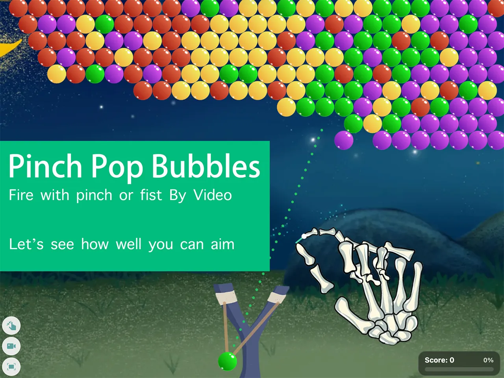

# Motion Bubble Shooter

> A **pure-browser**, gesture-based bubble-shooter game: open your camera, grab a bubble with a **pinch** (or a **fist**), pull back to aim like a slingshot, then release by opening your fingers — pop same-colored bubbles and clear all 13 levels.
> Open-sourced by [SwayJoy](https://swayjoy.com). This is a **single-game, single-page** app — no extra pages or routes.



**Language**: English · [中文版（README.zh-CN.md）](README.zh-CN.md)

---

## Table of Contents

1. [Tech Stack](#1-tech-stack)
2. [Gameplay & Controls](#2-gameplay--controls)
3. [Running the Project](#3-running-the-project)
4. [Parameters & Configuration](#4-parameters--configuration)
5. [Directory Structure](#5-directory-structure)
6. [FAQ](#6-faq)

---

## 1. Tech Stack

| Module | Technology | Notes |
| --- | --- | --- |
| Frontend framework | **Vue 3** (`<script setup>` + TypeScript) | Single-page app. No Vue Router / Pinia — cross-component state uses module-level `reactive` singletons |
| Build tool | **Vite 6** | `dev` / `build` / `preview` |
| Hand tracking | **MediaPipe Tasks `HandLandmarker`** (`@mediapipe/tasks-vision` 1.0.1) | Tracks 21 hand landmarks in real time; **GPU (WebGL) first, auto-falls back to CPU (WASM)**; inference runs locally over WASM — **no video frame leaves the device** |
| Inference model | `public/storage/vendor/mediapipe/tasks/hand_landmarker.task` | Loaded by the local WASM engine |
| Rendering | **Canvas 2D** (dual canvas) | `hand-canvas` draws skeleton feedback, `game-canvas` draws the game (bubbles / slingshot / effects); DPR-aware, ~60 FPS |
| Gesture recognition | Custom pure functions in `src/utils/gestureMatcher.js` | 14 gesture classes + EMA smoothing + hysteresis for pinch/fist detection |
| Audio | **Web Audio API** (bubble pops) + `HTMLAudioElement` (BGM) | All played locally in the browser |
| Styling | Plain CSS | `src/assets/css/main.css` (shared stage / screens / buttons) + `pinch-pop-bubbles.css` (game-specific) |

> Camera capture uses `getUserMedia`, defaulting to 720p / 60fps (switchable to 480p / 720p / 1080p in Settings).

---

## 2. Gameplay & Controls

### 2.1 Core interaction (two grab modes; pinch is the default — switchable in Settings or via the in-game button at the bottom-left)

| Step | Pinch (default) | Fist |
| --- | --- | --- |
| Grab | Bring thumb + index finger together near a bubble → grab it | Curl all five fingers into a fist → grab it |
| Aim | Keep pinching and pull back | Keep the fist and pull back |
| Launch | Open the thumb + index finger | Open the hand (≥ 4 fingers extended) |
| Cancel | Fully open the fingers (past threshold) | Cancel rarely triggers |

- Once a bubble is grabbed it **snaps onto the slingshot** — you can grab from anywhere on screen (your hand need not touch the slingshot).
- **The farther you pull back, the steadier your aim**: the dotted aim line wobbles less.
- The camera feed is hidden by default — only the skeleton overlay is shown (enable “Show camera feed” in Settings).

### 2.2 Scoring & passing

- **Popped bubbles**: 3 or more same-colored bubbles that connect get cleared → **+100 pts each**.
- **Dropped bubbles**: floating bubbles that fall after losing support → **+200 pts each**.
- The pass condition is set per level:
  - `OR`: reach the score **or** clear all bubbles — either satisfies it;
  - `AND`: reach the score **and** clear all bubbles (levels 11–13).

### 2.3 Screen flow

```
Home ── New Game / Continue ──▶ Level intro (8s countdown) ──▶ Playing
   ▲                                                          │
   │                                              pass ─ win (congrats/confetti)
   │                                              fail ─ summary (level map)
   └────────── Exit / Finish / Continue ◀─────────────────────┘
```

- Progress is stored in browser `localStorage` (keys in §4.4); clearing site data resets it.
- Playing fullscreen with your hand **30–80 cm** from the camera and good lighting gives the best results.

---

## 3. Running the Project

### 3.1 Requirements

- **Node.js ≥ 18** (20+ recommended)
- A modern browser (Chrome / Edge / Safari …) with **WebGL** and a camera
- The camera needs a **secure context**: developing on `http://localhost` is fine; serve over **HTTPS** for LAN / other hosts

### 3.2 Commands

```bash
npm install          # install dependencies

npm run dev          # dev server        → http://localhost:5173
npm run build        # production build  → dist/
npm run preview      # preview the build → http://localhost:4173
```

> The first time you open the page the browser asks for camera permission — click **Allow**.

---

## 4. Parameters & Configuration

### 4.1 Page / runtime switches

| Config | How | Notes |
| --- | --- | --- |
| Debug panel | **“Debug” button, always pinned at the top-left of the stage** | Click to expand/collapse the StatusPanel shown **below the game area** (a full-width bar — not floating, never covers the stage): gesture name / finger states / pinch ratio / FPS / delegate / camera switching / scrolling log |
| Inference delegate | **Switch** button inside the debug panel | Toggles between `GPU + WebGL` and `CPU + WASM` at runtime |
| Grab mode | “Grab mode” in the Settings dialog, or the bottom-left in-game button | `pinch` / `fist`; persisted to `localStorage` |
| Camera feed | “Show camera feed” in the Settings dialog, or the bottom-left stage button | Whether the camera image is displayed |
| Video quality | “Video quality” in the Settings dialog | `480p` / `720p` / `1080p` (default 720p) capture resolution |
| Background music | Built-in, loops from page load | Volume 0.35; see `BGM_VOLUME` in `src/App.vue` |
| Random backdrop | Auto-rotates per session | One of 7 × 1920×1080 backdrops is picked at random when entering a level |

### 4.2 Level config — `src/config/pinch-pop-bubbles/levels.js`

Tune level count, difficulty, and pass requirements by editing this one file (no engine changes needed).

| Field | Meaning |
| --- | --- |
| `bubbleCount` | Total number of bubbles |
| `clusterCount` | How many clusters bubbles are split into (smaller = more concentrated = easier) |
| `sameColorRatio` | Share of same-color neighbors, 0–1 (higher = easier to clear) |
| `colorCount` | Number of colors used (2–4) |
| `passScore` | Score needed to pass |
| `passMode` | `"OR"`: reach the score **or** clear the board; `"AND"`: satisfy both |
| `aimLineLength` | Visible length of the dotted aim line (ratio of content height; larger = easier to aim) |

The 13 shipped levels:

| Level | Bubbles | Clusters | Same-color | Colors | Pass score | Mode | Aim line |
| --- | --- | --- | --- | --- | --- | --- | --- |
| 1 | 30 | 2 | 0.80 | 2 | 720 | OR | 1.00 |
| 2 | 50 | 3 | 0.60 | 3 | 2000 | OR | 0.95 |
| 3 | 70 | 3 | 0.50 | 3 | 3920 | OR | 0.90 |
| 4 | 90 | 4 | 0.40 | 3 | 6480 | OR | 0.85 |
| 5 | 110 | 4 | 0.65 | 3 | 9680 | OR | 0.80 |
| 6 | 130 | 4 | 0.60 | 3 | 13520 | OR | 0.78 |
| 7 | 150 | 4 | 0.55 | 4 | 18000 | OR | 0.75 |
| 8 | 170 | 4 | 0.50 | 4 | 23120 | OR | 0.72 |
| 9 | 190 | 4 | 0.45 | 4 | 28880 | OR | 0.70 |
| 10 | 210 | 4 | 0.40 | 4 | 35280 | OR | 0.68 |
| 11 | 140 | 4 | 0.10 | 4 | 12000 | AND | 0.65 |
| 12 | 250 | 4 | 0.35 | 4 | 50000 | AND | 0.62 |
| 13 | 270 | 4 | 0.30 | 4 | 58320 | AND | 0.60 |

Difficulty curve: levels 1–10 ramp up bubble count / colors / same-color ratio (OR means a high score can bail you out); levels 11–13 switch to AND with a sharp same-color drop — you must both clear the board **and** hit the score.

### 4.3 Engine constants (for feel tuning, edit the constants at the top of `src/utils/pinch-pop-bubbles/bubbleGame.js`)

| Constant | Value | Meaning |
| --- | --- | --- |
| `BUBBLE_SIZE_RATIO` | 0.025 | Bubble radius = ratio of the smaller content dimension |
| `FLY_SPEED_RATIO` | 1.8 | Bubble flight speed = content height × ratio per second |
| `POP_DURATION_MS` / `POP_STAGGER_MS` | 350 / 50 | Pop animation length / stagger between consecutive clears |
| `GRAVITY_PX_PER_S2` | 900 | Gravity for pop particles |
| `SQUISH_DURATION_MS` / `AMPLITUDE` | 320 / 0.22 | “Squish” deformation on collision |
| `PINCH_GRAB_MIN / MAX` | 0.2 / 0.4 | Pinch grab window (normalized ratio) |
| `PINCH_LAUNCH` / `PINCH_CANCEL` | 0.5 / 2.0 | Pinch launch / cancel thresholds |
| `FIST_GRAB_MIN / MAX` | -0.01 / 0.35 | Fist grab window |
| `FIST_LAUNCH` / `FIST_CANCEL` | 0.7 / 2.0 | Fist launch / cancel thresholds |

> The normalized ratio = thumb–index distance ÷ finger length, so it is scale-invariant (distance from the camera does not affect detection); pinch open/close is EMA-smoothed.

### 4.4 `localStorage` keys

| Key | Content |
| --- | --- |
| `swayjoy:pinch-pop-bubbles:progress` | Passed level ids as an array (JSON) |
| `swayjoy:pinch-pop-bubbles:settings` | Grab mode / camera feed / video quality (JSON) |

---

## 5. Directory Structure

```
src/
├── App.vue                          # Entry shell: H1 “Bubble Shooter” + How to Play + stage + debug panel below the stage (toggled by the top-left button) + BGM
├── main.ts                          # Bootstrap; globally registers PinchPopBubbles* components; loads shared styles
├── components/pinch-pop-bubbles/    # Screen components (internal folder keeps the pinch-pop-bubbles name)
│   ├── GameClient.vue               # Core shell: camera + dual canvas + three rAF loops + level-overlay switching + debugOverlay slot (App injects the top-left Debug button)
│   ├── GameSettings.vue             # Settings dialog (grab mode / camera feed / video quality)
│   ├── LevelHome.vue                # Home screen (New Game / Continue)
│   ├── LevelIntro.vue               # Level intro (conditions + difficulty stars + 8s countdown)
│   ├── LevelComplete.vue            # Win screen (confetti + trophy + 5s countdown)
│   ├── LevelMap.vue                 # Level map (SVG snake path + trophies)
│   └── StatusPanel.vue              # Debug panel content (rendered below the game area; opened/closed by the top-left Debug button)
├── composables/pinch-pop-bubbles/   # State singletons (level state machine / game settings / debug panel)
├── utils/                           # Camera / MediaPipe tracking / gesture recognition / formatting / asset-URL prefix
│   └── pinch-pop-bubbles/           # Game engine bubbleGame.js (hex grid + physics) + handRig.js (cartoon-hand rig)
├── config/pinch-pop-bubbles/levels.js  # The 13 level configs (see §4.2)
├── types/game.d.ts                  # Gesture / engine types
└── assets/css/                      # main.css (shared) + pinch-pop-bubbles.css (game-specific)

public/                              # Static assets served as-is from /
├── dg.png                           # Slingshot image
├── pinch-pop-bubbles/               # Game backdrop etc.
├── game-common-ui/                  # Shared level-card / button art
└── storage/
    ├── pinch-pop-bubbles/           # Bubbles / hand parts / trophies / icons / SFX / rotating backdrops / BGM
    └── vendor/mediapipe/tasks/      # MediaPipe hand_landmarker.task + vision WASM (local inference)
```

---

## 6. FAQ

| Symptom | Fix |
| --- | --- |
| Camera permission denied / fails to start | Confirm permission was granted; you must be on **localhost or HTTPS** (HTTPS for phones / LAN), then refresh |
| Stuck on Loading | Click **Debug** (top-left of the stage) to check the delegate; confirm the model and WASM files under `public/storage/vendor/mediapipe/tasks/` are all present |
| Hand tracking is jittery / won’t grab | Keep your hand 30–80 cm away, light evenly, keep a second hand out of frame; enable the camera feed in Settings to see what’s happening |
| Low frame rate | Drop the camera quality to 480p; in the debug panel confirm the delegate is `GPU + WebGL` (falling back to CPU is normal on low-end machines) |
| Progress / settings reset | Clearing browser site data also wipes the progress key in `localStorage` (§4.4) |

---

## License

MIT — see [LICENSE](LICENSE).

---

## Author

**Holy Yang** · [https://swayjoy.com/about](https://swayjoy.com/about)
